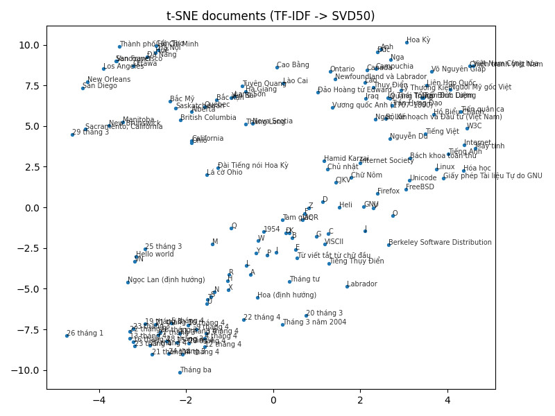
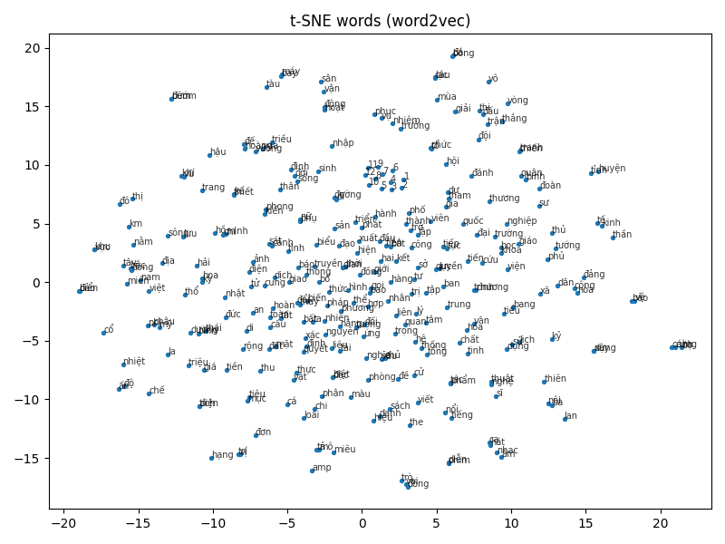
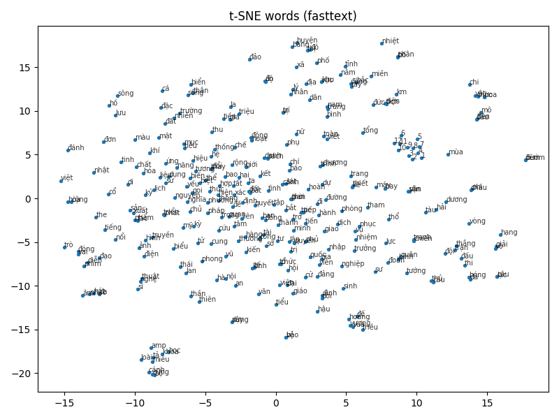

# 🇻🇳 Vietnamese Vector Space Model (VSM)

This project builds and visualizes a **Vector Space Model (VSM)** for Vietnamese text using **TF-IDF**, **Word2Vec**, and **FastText**.  
It includes preprocessing, training, similarity search, and t-SNE visualization for both documents and word embeddings.

---

## 🧩 Project Structure
<pre>
  Vietnamese-VSM/
  ├── data/
  │ ├── wikipedia_vi.csv                 # input dataset (id, title, text)
  │ ├── stopwords.txt                    # Vietnamese stopword list
  │ ├── corpus.txt                       # preprocessed & tokenized text (auto-generated)
  │ └── meta.csv                         # metadata: id, title (auto-generated)
  ├── models/
  │ ├── fasttext.bin                     # trained FastText embeddings
  │ ├── tfidf_matrix.svd50.npz           # reduced doc matrix (SVD 50)
  │ ├── tfidf_vectorizer.joblib          # saved TF-IDF model
  │ ├── word2vec.model                   # trained Word2Vec embeddings
  │ ├── word2vec.model.syn1neg.npy       # trained Word2Vec embeddings
  │ └── word2vec.model.wv.vectors.npy    # trained Word2Vec embeddings
  ├── make_data.py                       # text preprocessing & corpus generation
  ├── using_model_demo.py                # TF-IDF model training & similarity search
  ├── visualize.py                       # t-SNE visualization for docs or words
  ├── word2vec.py                        # Word2Vec training
  ├── fastText.py                        # FastText training
  └── requirements.txt                   # Python dependencies
</pre>

---

## ⚙️ Installation

**_Requires: Python 3.11_**

(Optional) Create and activate a virtual environment 

```bash
python -m venv venv
source venv/bin/activate          # on macOS/Linux
# or
venv\Scripts\activate             # on Windows
```

Install dependencies
```bash
pip install -r requirements.txt
```

---

## 📘 Data Preparation

Download `wikipedia_vi.`: [here](https://drive.google.com/file/d/1_gFXaM3vFplPnyJGsV1QY5gqgtFjArdg/view?usp=sharing)

Make sure `data/wikipedia_vi.csv` exists before running the program.

Then run:
```bash
python make_data.py --input wikipedia_vi.csv --stopwords stopwords.txt
```
This will generate:
```bash
data/corpus.txt
data/meta.csv
```

---

## 🧠 Train and Use TF-IDF Model

Train TF-IDF and save model
```bash
Train TF-IDF and save model
```

Query similar documents
```bash
python using_model_demo.py --query "Đại học Quốc Gia Hà Nội"
```
Example output:
```bash
#1  idx=3323  sim=0.7081  title=Đại học Quốc gia Hà Nội
#2  idx=1138283  sim=0.6408  title=Nguyễn Kim Sơn
#3  idx=86127  sim=0.6327  title=Khối Trung học phổ thông Chuyên Đại học Quốc gia Hà Nội
#4  idx=1273514  sim=0.6130  title=Trường Đại học Luật, Đại học Quốc gia Hà Nội
#5  idx=3005  sim=0.5836  title=Trường Đại học Tổng hợp Hà Nội
```

---

## 🌈 Visualization with t-SNE

### Document-level visualization
```bash
python visualize.py --mode docs --limit 150
```

This shows a scatter plot (t-SNE projection of TF-IDF → SVD-50)



### Word-level visualization (Word2Vec or FastText)

Train embeddings first:
```bash
python word2vec.py --vector_size 100 --min_count 2
# or
python fastText.py --input data/corpus.txt --model_path models/fasttext.bin
```

Then visualize:
```bash
python visualize.py --mode words --model word2vec --topk 300
# or
python visualize.py --mode words --model fasttext --topk 300
```
Example:
* Word2Vec

* FastText


---

## 📝 Notes

> 🧠 **Important:**  
> It is recommended to run this project inside a **Python virtual environment**.  
> Some dependencies (e.g., `underthesea`, `pyvi`, `fasttext`) may not install or run correctly on a local system without isolation.  
> If you encounter installation errors or version conflicts, create a virtual environment as shown below.
> 
---

## 📚 References

1. **Phạm Hồng Quang (2018).**  
   [Building a vector space model for Vietnamese](https://viblo.asia/p/xay-dung-mo-hinh-khong-gian-vector-cho-tieng-viet-GrLZDXr2Zk0)

2. **Mikolov et al. (2013).**  
   *Efficient Estimation of Word Representations in Vector Space.* arXiv:1301.3781

3. **Bojanowski et al. (2017).**  
   *Enriching Word Vectors with Subword Information.* TACL, 5, 135–146.

4. **van der Maaten & Hinton (2008).**  
   *Visualizing Data using t-SNE.* JMLR, 9, 2579–2605.

5. **Manning, Raghavan & Schütze (2008).**  
   *Introduction to Information Retrieval.* Cambridge University Press.


